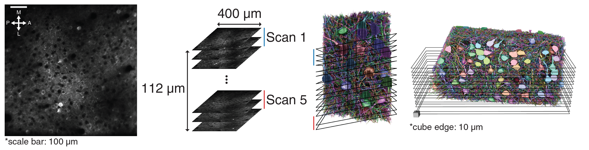

# Structure-function analysis

## Outline

### scripts
- `compute_neurite_length.py`: Compute axon/dendrite length using skeletons.
- `compute_degree.py`: Compute out/in-degree from the connectivity graph. (This may take several minutes to run.)
```python3
python [script_name.py]
```
The results will be saved in the `data` folder as `csv` format.
### notebooks
- `structure_function_analysis.ipynb` (Figure 7): Analysis testing whether visual response properties (response strength, intermittency, OSi) are correlated with local connectivity. 
- `orientation_direction_tuning.ipynb`: Compute tuning curves and determine significantly tuned cells with permutation test.
- `spatial_organization.ipynb` (Figure S7): Spatial organization of in-connection density in the volume.
- `visualize_response.ipynb`: Visualize responses to different stimuli along with the tuning curve.
- `datajoint_usage_example.ipynb`: Contains example codes for querying data from the DataJoint database. Refer to below DataJoint database section for instructions. *This notebook is not executable in mybinder.org.
### data
- `pyc_pyc_subgraph.csv`: Connectivity graph of pyramidal cell subgraph (only including synapses between pyramidal cells).
- `pyc_all_synapse.csv`: Connectivity graph of all synapses that's outgoing from pyramidal cell or incoming to pyramidal cell.
- `Stimulus.pkl`: Stimulus labels for all scans.
- `Neuron.pkl`: List of segment ids of pyramidal cells.
- `Soma.pkl`: Soma locations of pyramidal cells.
- `SynDensity.pkl`: In/out-synapse/connection density of pyramidal cells.
- `EASETrace.pkl`: Calcium traces of pyramidal cells.
- `EASETuning.pkl`: Tuning cruves and tuning curve properties of pyramidal cells.

## DataJoint database
This public database which contains extracted structural and functional data such as visual responses and connectivity data.  
  
  
*Refer to [SeungLab DataJoint repository](https://github.com/seung-lab/datajoint_seung) for detailed information of the tables in the schema.

### Registration
You need to be registered to access the database.  
Please fill out the [registration form](https://forms.gle/6SeDGRT8zoLqpbfU9) to receive user id and password.
*Currently, it is temporarily available without registration for the review process.

### Installation
DataJoint for Python requires Python 3.4 or above to function properly.
```
pip3 install datajoint
```
For more information, please checkout the [DataJoint Tutorials](https://tutorials.datajoint.io/setting-up/datajoint-python.html).  

### Database configuration
- HOST: datajoint.ninai.org
- USER: Given after registration
- PASSWORD: Given after registration

### Accessing the database
```python3
import datajoint as dj

# Datajoint credentials
dj.config["database.host"] = "datajoint.ninai.org"
dj.conn() # Then it will ask for your id and password

pinky = dj.create_virtual_module("seung_pinky", "seung_pinky")
```
*Pinky is the nickname for this dataset named after the American animated television series, *Pinky and the Brain*.

### Fetching data from the database
Example extracting visual response trace from the database.
```python3
key = {"segment_id": 648518346349539895, "scan_id": 2}
trace = (pinky.EASETrace() & key).fetch1("trace")
```
`datajoint_usage_examples.ipynb` contains examples of using the database to fetch data. Please refer to the [DataJoint Tutorials](https://tutorials.datajoint.io/setting-up/datajoint-python.html) for additional help.  

## Raw data

2-photon calcium imaging data acquired by Baylor College of Medicine.


### 2-photon structural stack
- Structural stack can be downloaded from [here](https://drive.google.com/file/d/1oS6lJbzk1pn6vjS5Jz2Q0tXNPbcfRIMy/view?usp=sharing).
- The file contains an array of 512 (h) x 512 (w) x 310 (depth).
- Voxel dimension is about 0.8 µm x 0.8 µm x 1 µm.
- The depth of the first section in the stack is assumed as z=0 µm.

### Calcium video
- Calcium videos can be downloaded from [here](https://drive.google.com/drive/folders/1nL0_asZkqiWrgkE-tpXIswf84tEdBwq_?usp=sharing).
- Each file is a recording of a single slice.
- Each file is an array of 256 (h) x 256 (w) x 27300 (time).
- Pixel dimension is about 1.6 µm x 1.6 µm.
- Frame rate is 14.8313 frames per second.
- Relative location of the slices (reference to the first section of structural stack).  

### Visual stimulus
- Stimulus videos and the labels can be downloaded from [here](https://drive.google.com/drive/folders/1-hLrXYclGwQmCX0VhjyrqJ8rpLsDSLgK?usp=sharing).
#### Stimulus video
- There exists one stimulus per scan.
- Each tiff file is the stimulus video shown for a particular scan.
- Each tiff file is an array of 90 (h) x 160 (w) x 27300 (time).
- Frame rate is 14.8313 frames per second.

#### Stimulus labels
- Each csv file contains labels of stimulus at each time frame.
- Each csv file has 27300 values.
- The value indicates the angle of the directional stimulus at that time frame. 
- If it’s empty (NaN), it indicates the noise stimulus (except for first 200 frames).
- First 200 frames are black screen stimulus for every scan.
- Frame rate is 14.8313 frames per second.

### Coregistration
- Coregistration information can be found [here](https://drive.google.com/drive/folders/1OOX3F-WazPngwvcoCBBBPcFj-hCHsSLd?usp=sharing).
- Three different images need to be coregistered: EM, 2p structural stack, and 2p video.
- 2p structural image is used as the reference. EM and 2p video are coregistered to 2p structural image.
- Refer to the [Colab notebook](https://colab.research.google.com/drive/1LrAu38-K_ZjOKSZkDLmlfTOjR38stV47?usp=sharing) in the folder to find the transformation.
