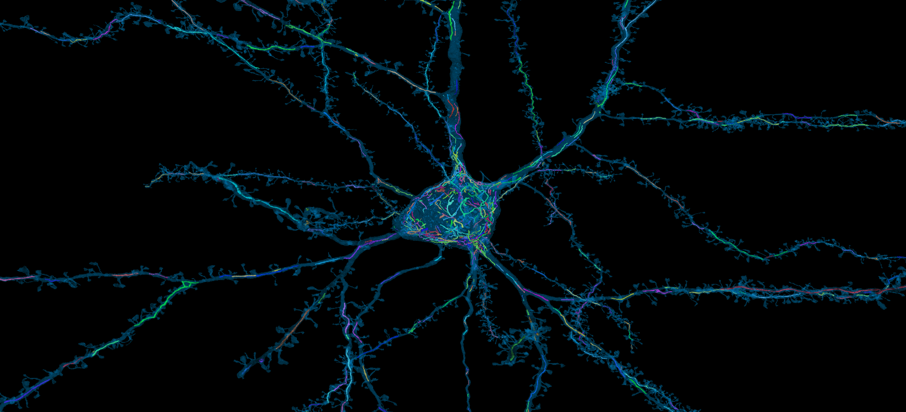

# Mitochondria analysis

Regulation of mitochondrion size in neurons affects synaptic plasticity ([Divakaruni et al., 2018](https://doi.org/10.1016/j.neuron.2018.09.025); [Rangaraju, Lauterbach and Schuman, 2019](https://doi.org/10.1016/j.cell.2018.12.013)), axonal and dendritic branching ([Li et al., 2004](https://doi.org/10.1016/j.cell.2004.11.003); [Bertholet et al., 2013](https://doi.org/10.1093/brain/awt060); [Courchet et al., 2013](https://doi.org/10.1016/j.cell.2013.05.021); [López-Doménech et al., 2016](https://doi.org/10.1016/j.celrep.2016.09.004); [Lewis et al., 2018](https://doi.org/10.1038/s41467-018-07416-2)), and synaptic transmission ([Sun et al., 2013](https://doi.org/10.1016/j.celrep.2013.06.040); [Kwon et al., 2018](https://doi.org/10.1371/journal.pbio.1002516); [Lewis et al., 2018](https://doi.org/10.1038/s41467-018-07416-2)). Here, we compare mitochondrion size across neuronal compartments and relate mitochondrial density within basal dendrites to their synapse density. We also give some basic tools for visualizing cells with their mitochondria within the reconstruction.

### Interactive Notebooks

* `compartment_comparison.ipynb` 
  An analysis notebook comparing mitochondria across neuronal compartments (Figure 5C)
* `density_analysis.ipynb`
  An analysis notebook relating mitochondrial volume density against synapse surface density (Figure 5D & 5E)
* `visualize.ipynb` (COMING SOON)
  A brief notebook that demonstrates a way to view a neuron rendered with its mitochondria.

### Base data

* `pni_mito_cellswskel_v185.csv`
  A dataframe that describes each mitochondrion that overlaps with one of the cells with a soma in the volume and a skeleton.
* `pni_nucleus_segments.csv`
  A dataframe that describes each predicted nucleus segment in the volume.

### Intermediate data

* `pni_mito_cellswskel_v185_fullstats.csv`
  A dataframe that adds a surface area measurement, the mitochondrial complexity index, and an inferred compartment label for each mitochondrion in `pni_mito_cellswskel_v185.csv`. Created by `scripts/computeextramitostats.py`
* `basicbranchstats.csv`
  Contains branch IDs, volume measurements and surface area measurement for each compartment branch of the analyzed cells. Created by `scripts/computebasicbranchstats.py`
* `mitotoskel.h5`
  Contains associations between mitochondria and the skeleton nodes of each cell. Created by `scripts/mitotoskel.py`
* `fullbranchstats.csv`
  A dataframe that adds synapse count, synapse surface density, mitochondrial volume, and mitochondrial volume density to the branch statistics in `basicbranchstats.csv`. Computed by `scripts/computedensitystats.py`
* `cellwisestats.csv`
  A dataframe that agglomerates the statistics from `fullbranchstats.csv` for each cell's compartments in bulk. Created by `scripts/computedensitystats.py`

### Scripts

See `scripts/README.md` and `scripts/derivedata.sh` for a walkthrough of how to compute the intermediate data.
