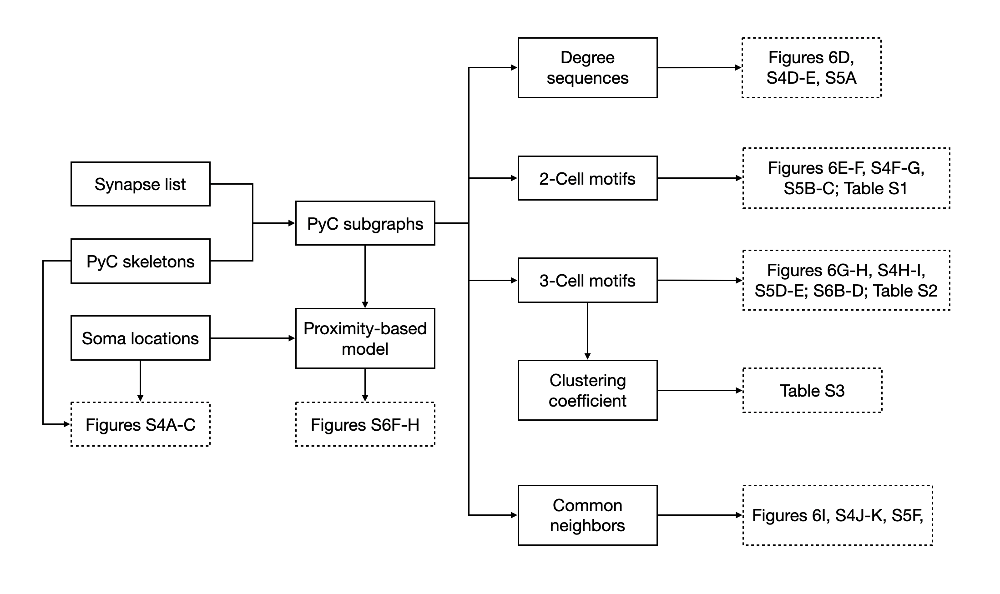

# Motif Analysis for Pinky PyC Subgraph

Previous studies employing synaptic physiology in cortical brain slices reported "highly nonrandom" connectivity motifs ([Song et al., 2005](https://journals.plos.org/plosbiology/article?id=10.1371/journal.pbio.0030068); [Perin, Berger and Markram, 2011](https://www.pnas.org/content/108/13/5419)), high network transitivity, and a common neighbor rule ([Perin, Berger and Markram, 2011](https://www.pnas.org/content/108/13/5419)). Here, we investigate local graph-theoretic properties of the reconstructed 363 pyramidals cells (and subsets of them), including in- and out-degree distributions, 2-node motif statistics, 3-node motif statistics, network transitivity, and higher-order motif statistics such as the common neighbor rule. The claim of "nonrandomness" was relative to the Erdős-Rényi (ER) model of random graphs, which considers connections between all pairs of nodes to be equally probable. In addition to the comparison with ER, we also compare the observed statistics with a "configuration model" (CFG), which constrains both in-degree, the number of presynaptic partners of a cell, and out-degree, the number of postsynaptic partners of a cell, and a "proximity model" (PM), which contains the connection probability by soma distance.

Analysis flowchart: solid boxes indicate data, dashed boxes indicate manuscript display items

### Interactive Notebooks

Each notebook demonstrates the data processing procedure for each independent analysis. Intermediate results are stored in `saved` folder for time-consuming steps (>60s). The prefix `th{x}-` indicates neurons with axon lengths less than x μm are excluded in the network analysis to alleviate the truncation effect. 

-  Locations of a subset of PyCs with axon lengths; in-/out-degree distributions compared with ER:
	- `th100-degree-dist.ipynb` (Figure 5 D; Figure S5 B)
	- `th0-degree-dist.ipynb` (Figure S5 A, D)
	- `th300-degree-dist.ipynb` (Figure S5 C, E)
	- `full-degree-dist.ipynb` (Data S4 A)
-  2-cell and 3-cell motif statistics, clustering coefficient compared with ER and CFG, and their generalized versions which preserve the statistics of 2-cell motifs.
	- `th100-2-and-3-neuron-motifs.ipynb` (Figure 5 E, F, G, H; Table 1; Data S5 B, C, D; Table S1; Table S2; Table S3)
	- `th0-2-and-3-neuron-motifs.ipynb` (Figure S5 F, H)
	- `th300-2-and-3-neuron-motifs.ipynb` (Figure S5 G, I)
	- `full-2-and-3-neuron-motifs.ipynb` (Data S4 B, C, D, E)
- Common neighbor rule compared with ER, CFG, gER, and gCFG
	- `th100-common-neighbor-rule.ipynb` (Figure 5 I)
	- `th0-common-neighbor-rule.ipynb` (Figure S5 J)
	- `th300-common-neighbor-rule.ipynb` (Figure S5 K)
	- `full-common-neighbor-rule.ipynb` (Data S4 F)
- Degree distributions, 2-cell and 3-cell motifs, clustering coefficient, and common neighbor rule in a proximity constrained model
	- `proxy-th100-degree-dist.ipynb` (Data S5 F)
	- `proxy-th100-2-and-3-neuron-motifs.ipynb` (Data S5 G)
	- `proxy-th100-common-neighbor-rule.ipynb` (Data S5 H)
    
### Base Data
- `data/soma.csv` A dataframe that describes cell ids, locations, axon and dendrite lengths.
- `data/synapses.csv`  A dataframe that contains pre- and post-synaptic cell ids.

### Intermediate Data
For the following files, `subgraph` can take values `{'full', 'th0', 'th100', 'th300'}`, and `model` can take values from `{'cfg', 'gcfg', 'ger', 'pm'}`.
- `saved/{subgraph}_2motif_{model}{sample_size}.csv` Dataframe that describes sampled 2-cell motifs.
- `saved/{subgraph}_3motif_{model}{sample_size}.csv` Dataframe that describes sampled 3-cell motifs.
- `saved/{subgraph}_cnr_{model}{sample_size}.csv` Dataframe that describes sampled common neighbor statistics.
- `saved/{subgraph}_cnrstd_{model}{sample_size}.csv` Dataframe that describes sampled common neighbor statistics (auxillary).
- `saved/proximity_{subgraph}_avg10um.csv` Dataframe that contains statistics for building proximity constrained models.
