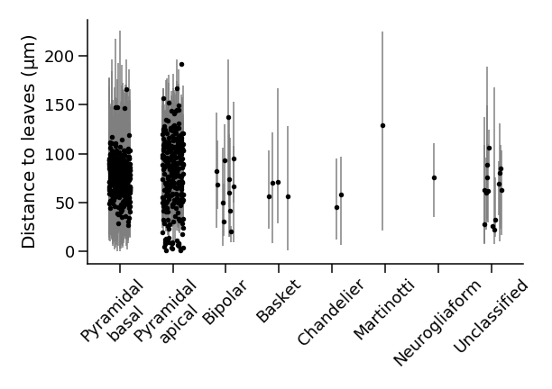

# Resource statistics

Here we quantify the branch length of each reconstructed cell in the volume with clean compartment labels,
and compare the pyramidal cell dendritic arbor lengths to some expected values from the literature ([Gilman, Medalla & Luebke 2017](https://doi.org/10.1093/cercor/bhw062)).

### Interactive Notebooks

* `neurite_lengths.ipynb` 
  Plots axon and dendrite branch lengths for each cell with clean compartment labels and a soma in the volume. Branch length is quantified here as the distance between a soma and each leaf of the skeleton.

### Base data

* `data/soma_ids/p100_pyr_soma_IDs_v185.csv`  
  A list of PyC ids with their soma captured by the volume for proofreading version 185
* `data/soma_ids/p100_inh_soma_IDs_v185.csv`  
  A list of interneuron ids with their soma captured by the volume for proofreading version 185
* `data/clean_compartment_ids_v185.csv`  
  A list of ids for which the skeleton compartment labels are sufficiently correct
* `../data/smoothed_skels_v185`  
  A set of smoothed skeletons for all cells with their soma captured by the volume. These were computed using MeshParty

### Intermediate data

* `data/pyr_dist_to_leaves.csv`
  A dataframe that describes the length of each branch for every PyC
* `data/inh_dist_to_leaves.csv`
  A dataframe that describes the length of each branch for every putative interneuron
* `data/pyr_compartment_lengths.csv`
  A dataframe that describes the total path length covered by each compartment label for each PyC
* `data/inh_compartment_lengths.csv`
  A dataframe that describes the total path length covered by each compartment label for each putative interneuron

### Scripts

* `scripts/compute_dist_to_leaf.py`
  Computes the length of each branch for each PyC and putative interneuron from the smoothed skeletons
* `scripts/compute_compartment_lengths.py`
  Computes the total path length covered by each compartment label for a given set of cells

See `scripts/README.md` for a walkthrough of how to compute the intermediate data.
